# Spreadsheet Analysis

# Data Analysis Report

## Data Set Details:

### Origin of Data Set:

The data set used for this analysis is sourced from [International Liquidity Statistics](https://data.imf.org/regular.aspx?key=61545856). The dataset provides information on various indicators related to international liquidity over several years.

### Format of Original Data File:

The original data file is in Excel format (.xlsx).

### Raw Data Sample:

Here are rows of the raw data:

| Indicator                                                                                                                                                                    | Scale          | Base Year | 2002 | 2003         | 2004         | 2005         | 2006         | 2007         | 2008         | 2009         | 2010         | 2011         | 2012         | 2013         | 2014         | 2015         | 2016         | 2017         | 2018         | 2019         | 2020         | 2021         | 2022         |
| ---------------------------------------------------------------------------------------------------------------------------------------------------------------------------- | -------------- | --------- | ---- | ------------ | ------------ | ------------ | ------------ | ------------ | ------------ | ------------ | ------------ | ------------ | ------------ | ------------ | ------------ | ------------ | ------------ | ------------ | ------------ | ------------ | ------------ | ------------ | ------------ |
| International Liquidity, Total Reserves excluding Gold, US Dollars                                                                                                           | RAXG_USD       | Millions  |      | 67,962.41    | 74,894.07    | 75,889.99    | 54,083.72    | 54,853.87    | 59,524.23    | 66,607.01    | 119,718.87   | 121,391.81   | 136,912.23   | 139,133.87   | 133,533.46   | 119,048.48   | 106,539.64   | 106,290.81   | 112,251.91   | 114,756.99   | 118,437.72   | 133,849.10   | 240,197.34   | 232,716.64 |
| International Reserves, Official Reserve Assets, SDRs, US Dollars                                                                                                            | RAFASDR_USD    | Millions  |      | 12,165.71    | 12,637.64    | 13,627.60    | 8,209.77     | 8,870.10     | 9,476.41     | 9,340.39     | 57,813.62    | 56,824.43    | 54,954.78    | 55,050.35    | 55,184.11    | 51,940.79    | 49,688.07    | 48,882.51    | 51,863.67    | 50,802.61    | 50,748.86    | 52,941.99    | 163,629.42   | 160,537.43 |
| International Reserves, Official Reserve Assets, IMF Reserve Position, US Dollars                                                                                            | RAFAIMF_USD    | Millions  |      | 21,978.71    | 22,534.60    | 19,544.08    | 8,035.86     | 5,040.32     | 4,243.98     | 7,683.05     | 11,385.40    | 12,492.19    | 30,079.82    | 34,161.14    | 30,749.93    | 25,164.19    | 17,609.21    | 18,385.32    | 17,633.01    | 22,016.36    | 26,153.28    | 36,370.36    | 35,831.64    | 34,970.46 |
| International Liquidity, Total Reserves excluding Gold, Foreign Exchange, US Dollars                                                                                         | RAXGFX_USD     | Millions  |      | 33,818.00    | 39,721.83    | 42,718.31    | 37,838.08    | 40,943.46    | 45,803.84    | 49,583.57    | 50,519.86    | 52,075.19    | 51,877.62    | 49,922.38    | 47,599.43    | 41,943.50    | 39,242.35    | 39,022.98    | 42,755.23    | 41,938.02    | 41,535.58    | 44,536.75    | 40,736.28    | 37,208.75 |
| International Reserves, Official Reserve Assets, Gold (Including Gold Deposits and, If Appropriate, Gold Swapped), Volume in Millions of Fine Troy Ounces , Fine Troy Ounces | RAFAGOLDV_OZT  | Millions  |      | 262.00       | 261.55       | 261.59       | 261.55       | 261.50       | 261.50       | 261.50       | 261.50       | 261.50       | 261.50       | 261.50       | 261.50       | 261.50       | 261.50       | 261.50       | 261.50       | 261.50       | 261.50       | 261.50       | 261.50       | 261.50 |
| International Liquidity, Gold Holdings, National Valuation, US Dollars                                                                                                       | RAFAGOLDNV_USD | Millions  |      | 11,043.00    | 11,043.07    | 11,044.75    | 11,043.24    | 11,041.06    | 11,041.06    | 11,041.06    | 11,041.06    | 11,041.06    | 11,041.06    | 11,041.06    | 11,041.06    | 11,041.06    | 11,041.06    | 11,041.06    | 11,041.06    | 11,041.06    | 11,041.06    | 11,041.06    | 11,041.08    | 11,041.06 |
| Monetary, Central Bank Survey, Net Foreign Assets, Claims on Non-residents, Other Foreign Assets, International Liquidity, US Dollars                                        | FASAFOIL_USD   | Millions  |      | \-           | \-           | \-           | \-           | \-           | 14,000.00    | 553,728.00   | 10,272.00    | 75.00        | 99,823.00    | 8,889.00     | 273.00       | 1,528.00     | 997.00       | 4,826.00     | 12,008.00    | 4,207.00     | 3,729.00     | 17,883.00    | 3,341.00     | 412.00 |
| Monetary, Central Bank Survey, Net Foreign Assets, Liabilities To Non-residents, Other Foreign Liabilities, International Liquidity, US Dollars                              | FASLFOIL_USD   | Millions  |      | 20,535.00    | 25,814.00    | 30,025.00    | 30,457.00    | 32,218.00    | 40,639.00    | 89,717.00    | 72,719.00    | 62,916.00    | 89,052.00    | 106,016.00   | 116,992.00   | 118,374.00   | 226,303.00   | 255,010.00   | 244,296.00   | 250,006.00   | 254,249.00   | 230,942.00   | 287,955.00   | 342,583.00 |
| Monetary, Other Depository Corporations Survey, Net Foreign Assets, Claims on Non-residents, US Dollars                                                                      | FOSAF_USD      | Millions  |      | 852,513.92   | 936,847.52   | 1,117,965.68 | 1,287,144.54 | 1,635,613.37 | 2,050,398.38 | 1,820,028.29 | 2,434,729.82 | 2,591,154.42 | 2,392,626.90 | 2,336,757.84 | 2,296,651.23 | 2,304,945.85 | 2,229,391.44 | 2,314,523.87 | 2,494,314.12 | 2,458,154.90 | 2,843,622.22 | 3,052,504.19 | 3,270,573.34 | 3,332,538.52 |
| Monetary, Other Depository Corporations Survey, Net Foreign Assets, Liabilities to Non-residents, US Dollars                                                                 | FOSLF_USD      | Millions  |      | 828,238.23   | 978,679.71   | 1,228,520.81 | 1,361,928.82 | 1,759,556.90 | 1,887,128.54 | 2,077,569.48 | 2,224,745.06 | 2,304,371.45 | 2,485,598.28 | 2,231,989.60 | 2,469,616.93 | 2,453,961.89 | 2,259,806.91 | 2,219,343.57 | 2,408,532.08 | 2,347,596.43 | 2,401,680.53 | 2,606,535.14 | 2,789,939.14 | 2,984,354.86 |
| Monetary, Other Financial Corporations Survey, Net foreign Assets, Claims on Non-residents, US Dollars                                                                       | FFSAF_USD      | Millions  |      | 1,486,677.27 | 2,011,480.12 | 2,485,871.98 | 2,966,244.68 | 3,663,463.81 | 4,394,625.54 | 2,978,172.33 | 3,788,058.73 | 4,495,391.56 | 4,348,303.27 | 5,043,580.32 | 5,530,820.12 | 5,709,978.19 | 5,485,466.81 | 5,809,264.23 | 7,095,172.60 | 6,534,957.52 | 7,703,582.63 | 8,273,817.76 | 9,025,735.17 | ... |
| Monetary, Other Financial Corporations Survey, Net foreign Assets, Liabilities to Non-residents, US Dollars                                                                  | FFSLF_USD      | Millions  |      | 1,173,880.43 | 1,411,384.71 | 1,841,701.02 | 2,189,919.34 | 2,910,709.83 | 3,356,898.11 | 2,727,474.71 | 2,889,204.44 | 2,708,597.46 | 2,636,662.16 | 2,479,047.76 | 2,426,648.44 | 2,426,619.88 | 2,410,186.15 | 2,558,051.60 | 2,668,066.66 | 2,746,778.21 | 2,837,095.63 | 2,872,836.57 | 2,982,823.62 | ... |

## Data Scrubbing:

### Problems in the Original Data:

1. **Unnecessary Columns:**
   - The data contained column 'Base Year' that was empty and  irrelevant to the analysis.
   - **Solution:** Removed unnecessary column using Python.

2. **Data Format Issues:**
   - Some cells contained placeholders like '-' or '...' which needed to be addressed.
   - **Solution:** Replaced these placeholders with `None` values using Python.

3. **Column Renaming:**
   - Column names lacked clarity and were renamed for better understanding.
   - **Solution:** Renamed columns using Python.

4. **Rows to Skip:**
    - The first 7 rows were not data and needed to be skipped.
    - **Solution:** Skipped the first 7 rows while reading the Excel file using Python.
    
5. **Empty First Column:**
    - The first column in the data was empty.
    - **Solution:** Skipped the empty first column using Python.

6. **First header name:**
    - The first header name 'Indacator' contains 2 columns.
    - **Solution:** Rename columns as 'Indacator', 'Abbreviation'.
    

### Scrubbing in Python:

```python
    # Read the Excel file
    df = pd.read_excel(input_file_path, skiprows=7)

    # Drop an empty column
    df = df.drop(columns=df.columns[0])

    # Removing unnecessary columns
    columns_to_remove = ['Base Year']
    df = df.drop(columns=columns_to_remove)

    # Replace all '-' and '...' with None in the entire DataFrame
    df = df.replace(['-', '...'], None)

    # Rename columns for better clarity
    column_mapping = {'Unnamed: 2': 'Abbreviation'}
    df = df.rename(columns=column_mapping)
```
### Links to Data Files:
- [Original Raw Data](./data/international_liquidity.xlsx);
- [Munged Data](./data/cleaned_data.csv);
- [Spreadsheet with Formulas](./data/analysis_results_function.xlsx);
- [Charts](./images).

## Analysis:
### Summary Table
The summary table provides a concise overview of key aggregate statistics for each indicator over the entire time period (2002-2023).

| Statistic | Description |
| --- | --- |
| Min | Minimum value of the indicator across all years. |
| Max | Maximum value of the indicator across all years. |
| Sum | Total sum of the indicator across all years. |
| Mean | Mean (average) value of the indicator across all years. |


###### Insights:
 - Range: The Min and Max values showcase the range of values the indicators have taken over the years.
 - Magnitude: The Sum indicates the cumulative magnitude of each indicator, offering insights into their overall impact or contribution.
 
### Summary Table with Condition
This table considers only indicators with a total sum greater than 1,000,000, providing a focused view on selected indicators.

| Statistic | Description |
| --- | --- |
| Min | Minimum value of the selected indicators. |
| Max | Maximum value of the selected indicators. |
| Sum | Total sum of the selected indicators. |
| Mean | Mean (average) value of the selected indicators. |

###### Insights:
 - Significance: By filtering for indicators with a total sum above 10,000,000, we focus on those with more significant contributions or impacts.
 
### Line Charts for Each Indicator Over Years
Line charts visualize the trend of each indicator over the years, offering insights into their patterns and fluctuations.
```python
 for index, row in df.iterrows():
      indicator = row['Indicator']

      # Convert row data to NumPy array
      row_data = pd.to_numeric(row[3:], errors='coerce').values

      plt.figure(figsize=(15, 6))
      plt.plot(df.columns[3:].to_numpy(), row_data, marker='o')
      plt.title(f'{indicator} Over Years')
      plt.xlabel('Year')
      plt.ylabel('Value')
      plt.xticks(df.columns[3:].to_numpy())
      plt.grid(True)

      # Replace spaces with underscores and remove commas in the image file name
      image_name = f'{indicator}_plot.png'.replace(' ', '_').replace(',', '')

      image_path = os.path.join(images_folder, image_name)
      plt.savefig(image_path)
      plt.close()
```
### International Liquidity, Total Reserves excluding Gold, US Dollars (RAXG_USD):

- **Increasing Trend:** The indicator shows a general increasing trend over the years, indicating a growth in total reserves excluding gold.
- **Fluctuations:** Despite the overall trend, there are fluctuations, suggesting periods of variability in international liquidity.

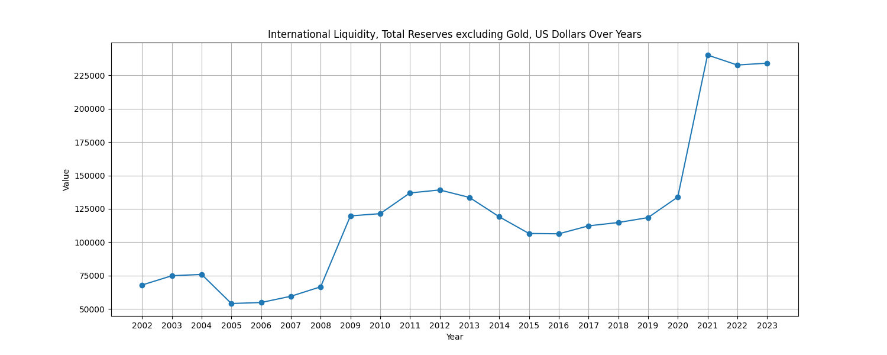

### International Reserves, Official Reserve Assets, SDRs, US Dollars (RAFASDR_USD):

- **Increasing Trend:** The indicator shows a general increasing trend over the years.
- **Distinct Peaks:** Noticeable peaks around 2008 and 2020 may indicate specific events or policy changes affecting SDR holdings.

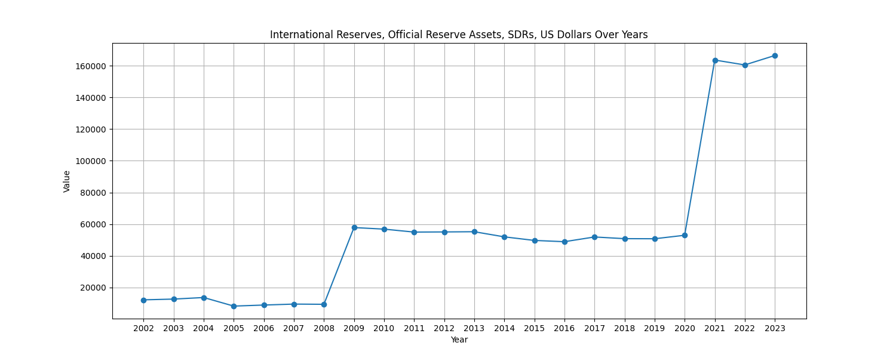

### International Reserves, Official Reserve Assets, IMF Reserve Position, US Dollars (RAFAIMF_USD):

- **Volatility:** The indicator displays significant volatility, with periods of both rapid increase and decrease.

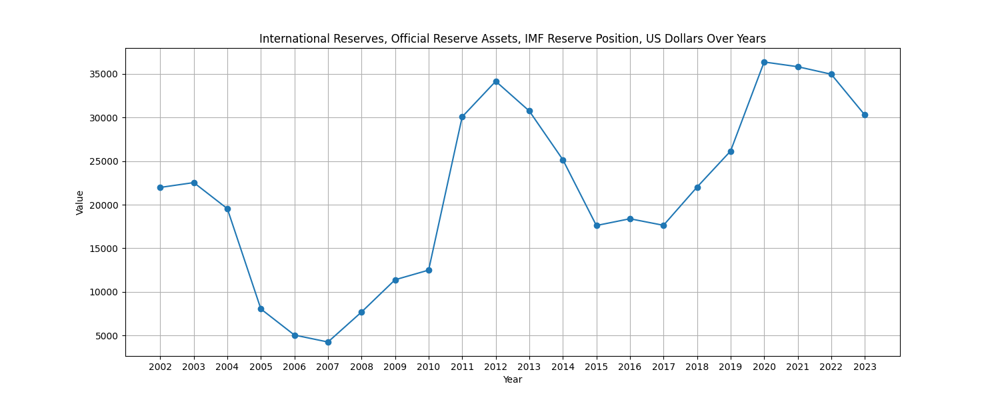

### International Liquidity, Total Reserves excluding Gold, Foreign Exchange, US Dollars (RAXGFX_USD):

- **Volatility:** The indicator displays significant volatility, with periods of both rapid increase and decrease.

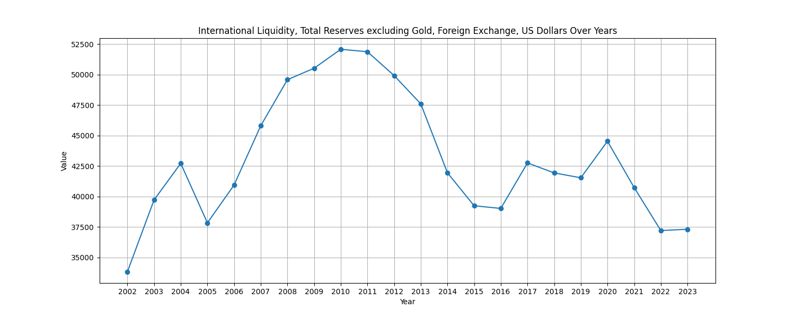

### International Reserves, Official Reserve Assets, Gold (RAFAGOLDV_OZT):

- **Steady Values:** The gold reserve volume remains relatively steady over the years.
- **Flat Trend:** There are no significant downward trend in 2003

_Volume_in_Millions_of_Fine_Troy_Ounces__Fine_Troy_Ounces_plot.png)

### International Liquidity, Gold Holdings, National Valuation, US Dollars (RAFAGOLDNV_USD):

- **Constant Value:** Significant drop in 2006 followed by stability. The line chart shows a constant value for gold holdings in national valuation in US dollars after 2006.

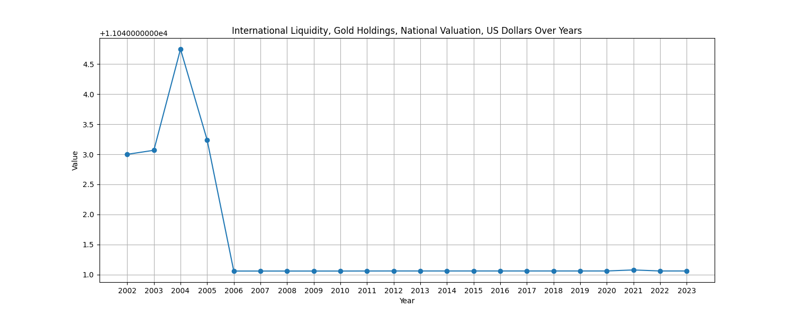

### Monetary, Central Bank Survey, Net Foreign Assets, Claims on Non-residents, Other Foreign Assets, International Liquidity, US Dollars (FASAFOIL_USD):

- **Data Anomaly:** No data before 2007. Following this, there is a notable sharp increase, followed by a decline, and then a sustained period of consistently low values.
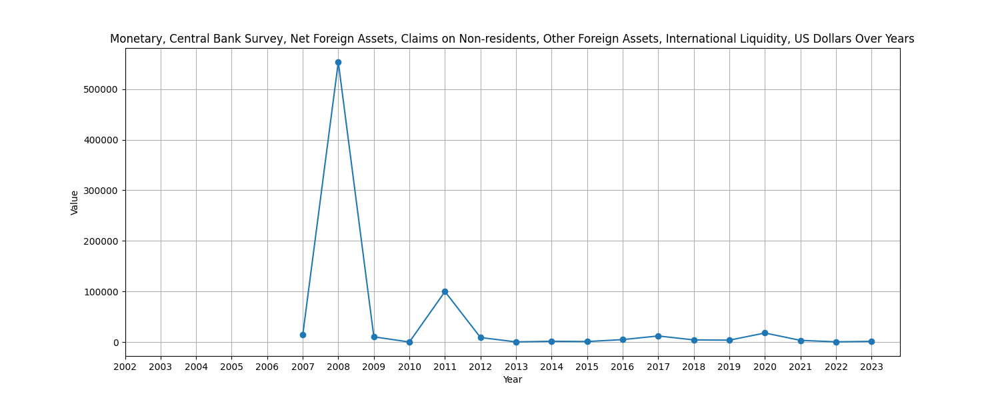
### Monetary, Central Bank Survey, Net Foreign Assets, Liabilities To Non-residents, Other Foreign Liabilities, International Liquidity, US Dollars (FASLFOIL_USD):

- **Increasing Trend:** The indicator shows a general increasing trend over the years, indicating a growth in net foreign liabilities to non-residents.

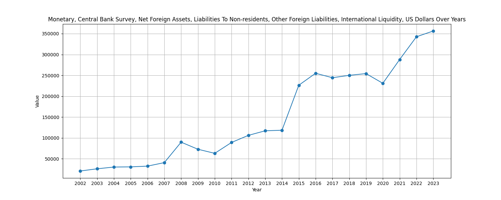

### Monetary, Other Depository Corporations Survey, Net Foreign Assets, Claims on Non-residents, US Dollars (FOSAF_USD):

- **Continuous Growth:** The line chart depicts a continuous growth trend in net foreign assets, claims on non-residents by other depository corporations.

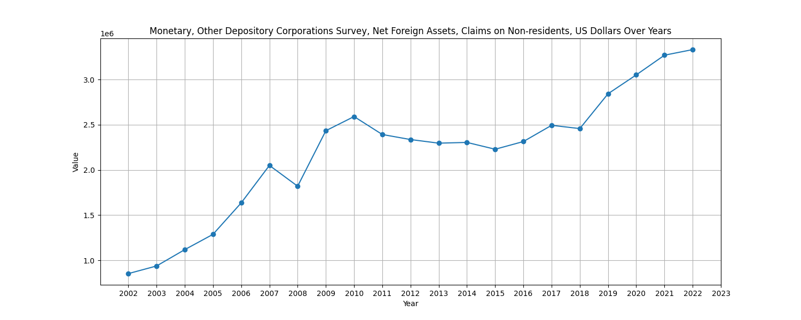

### Monetary, Other Depository Corporations Survey, Net Foreign Assets, Liabilities to Non-residents, US Dollars (FOSLF_USD):

- **Variable Trend:** The indicator shows a variable trend with periods of both increase and decrease, suggesting fluctuations in net foreign liabilities to non-residents.

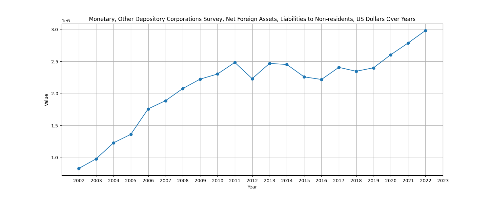

### Monetary, Other Financial Corporations Survey, Net foreign Assets, Claims on Non-residents, US Dollars (FFSAF_USD):

- **Consistent Growth:** The line chart illustrates consistent growth in net foreign assets, claims on non-residents by other financial corporations.

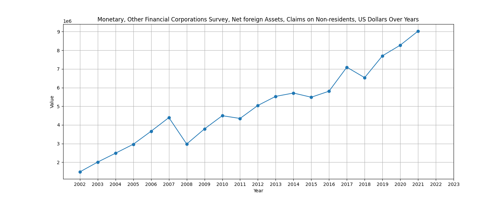

### Monetary, Other Financial Corporations Survey, Net foreign Assets, Liabilities to Non-residents, US Dollars (FFSLF_USD):

- **Variable Trend:** Similar to other indicators, there is a variable trend in net foreign liabilities to non-residents, indicating fluctuations over the years.

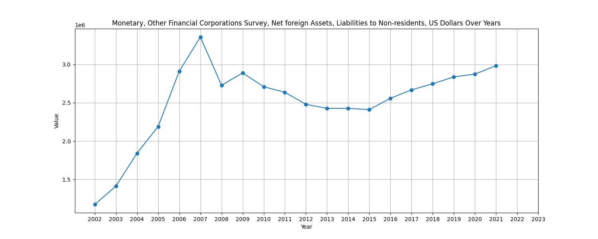


### Bar Chart - Total Sum of Selected Indicators Over Years
Line charts visualize the trend of each indicator over the years, offering insights into their patterns and fluctuations.
```python
# Plotting the bar chart for the sum of selected indicators
total_sum_series = df.drop(columns=skip_columns)[selected_columns].sum().squeeze()
plt.figure(figsize=(15, 6))
plt.bar(selected_columns, total_sum_series, label='Total Sum', color='blue')
plt.title('Total Sum of Selected Indicators Over Years')
plt.xlabel('Indicator')
plt.ylabel('Sum')
plt.grid(True)
plt.legend()
sum_chart_path = os.path.join(images_folder, 'total_sum_chart.png')
plt.savefig(sum_chart_path)
plt.close()
```
#### Insights:

- **Steady Growth:** The chart reveals a consistent growth pattern in the total sum of selected indicators across the years.
- **Overall Trend Analysis:** Assessing the overall trend helps in understanding the cumulative impact of the selected indicators on the economic landscape.

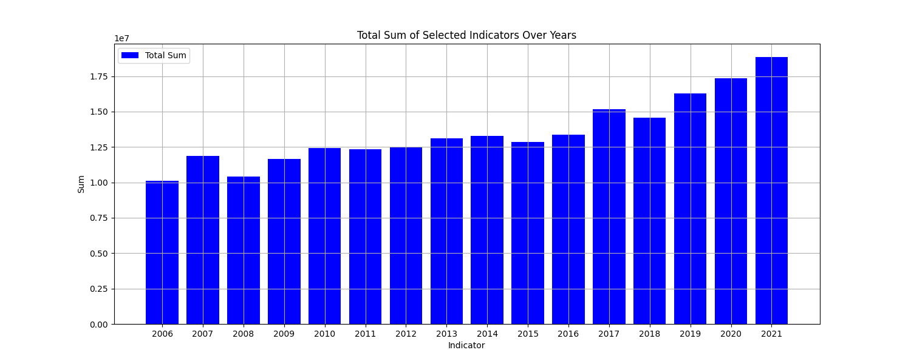